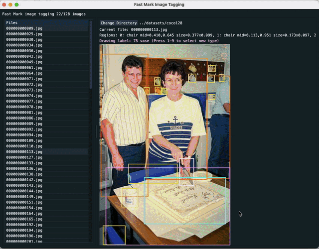

# FastMark

FastMark is a simple GUI tool for tagging images in the Darknet format, widely used for image recognition datasets such as the YOLO system. It aims to streamline the bounding box annotation process, helping you prepare data for object detection tasks more efficiently.


## Key Features
- Quick image loading and labeling
- Automated generation of annotation files in Darknet format
- Compatible with YOLO-based processes

## Usage
1. Open a dataset folder.
2. Draw and label bounding boxes with intuitive controls.
3. Automatically save annotations for YOLO training.

For further instructions, refer to project documentation or any tutorials covering Darknet and YOLO workflows.

## Demo


## Data layout
Assumes data is on the filesystem as:

```plaintext
target-dir/
   ├── labels.txt
   ├── images/
   │   ├── *.jpg
   │   └── *.png
   └── labels/
       └── *.txt
```

Where the `labels.txt` file contains the dataset categories, and the files in `labels/*.txt` match the names of the ones in `images/*.jpg, *.png`. The files in `labels/*.txt` will be automatically updated when a rectangle is drawn, and created if they do not already exist.

## Keyboard shortcuts
* 0-9: Select the label category that will be drawn for subsequent rectangles
* up-arrow, k: move to previous image
* down-arrow, j: move to next image
* n: Select next image that isn't labelled (N for previous)
* left-arrow: select previous category
* right-arrow: select next category

# Building a dataset

If you have a selection of previously recorded, but uncategorised videos, you can extract the frames as individual trainable images using `ffmpeg`:
```sh
for f in training_videos/*.mp4 ; do
    base=$(basename $f)
    ffmpeg -i $f images/${base%%.mp4}-%04d.png
done
```

Once this is complete, created `labels.txt` with the various categories, and then use FastMark to create the per-image label information.